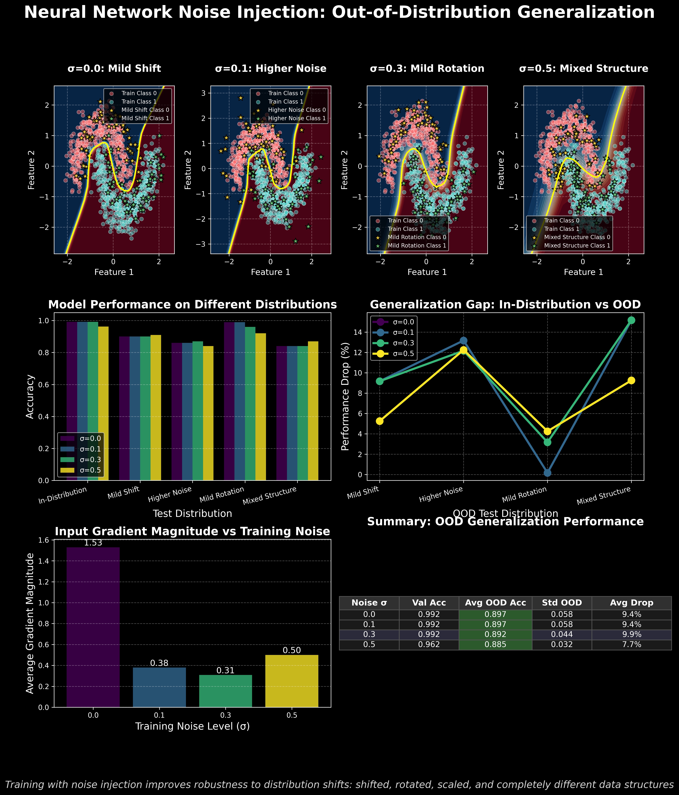
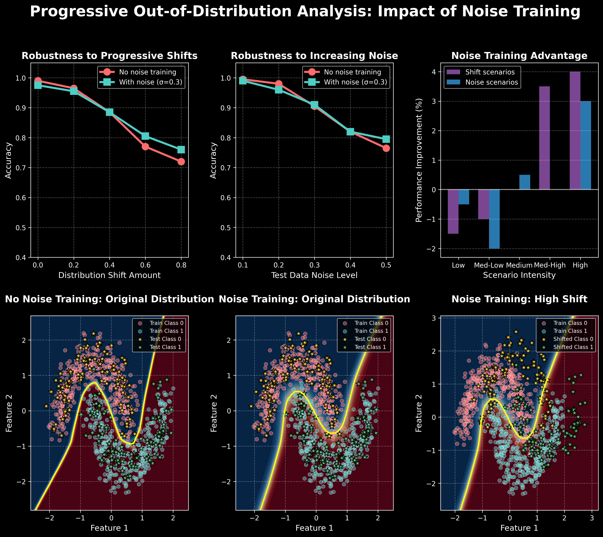

# Neural Network Noise Robustness Demonstration

This project demonstrates how introducing noise during neural network training improves out-of-distribution (OOD) generalization. The code provides visualizations and quantitative analysis of how noise injection affects robustness to distribution shifts using synthetic datasets.

## Features
- **Train neural networks with varying levels of input noise**
- **Visualize decision boundaries and OOD generalization**
- **Compare performance on in-distribution and OOD test sets**
- **Analyze gradient magnitudes and generalization gaps**

## How It Works
- **Training Data:** Uses the "two moons" dataset with added boundary samples for increased challenge.
- **OOD Scenarios:** Evaluates on shifted, rotated, noisier, and mixed-structure datasets.
- **Noise Injection:** Trains models with different noise levels (σ = 0.0, 0.1, 0.3, 0.5) added to the input during training.
- **Visualization:** Generates comprehensive figures showing decision boundaries, accuracy comparisons, performance drops, and summary tables.

## Usage

### 1. Install Dependencies
This project requires Python 3.7+ and the following packages:

- numpy
- matplotlib
- seaborn
- torch
- scikit-learn
- scipy

You can install them with:

```bash
pip install numpy matplotlib seaborn torch scikit-learn scipy
```

### 2. Run the Demo
Simply execute the main script:

```bash
python main.py
```

This will:
- Train neural networks with different noise levels
- Generate and display visualizations
- Save the figures as `noise_ood_generalization.png` and `noise_progressive_ood.png`

### 3. Output
- **Figures:**
  - `noise_ood_generalization.png`: Shows decision boundaries, OOD performance, generalization gaps, gradient analysis, and summary table.
  - `noise_progressive_ood.png`: Shows robustness to progressive distribution shifts and noise, and the advantage of noise training.

## Example Visualizations




## Customization
- You can adjust noise levels, dataset sizes, or OOD scenarios by modifying the parameters in `main.py`.
- The code is modular and easy to extend for other synthetic or real datasets.

## Citation
If you use this code or figures in your work, please cite or reference this repository.

---

**Author:** marcel@btec.ch 
**License:** MIT 